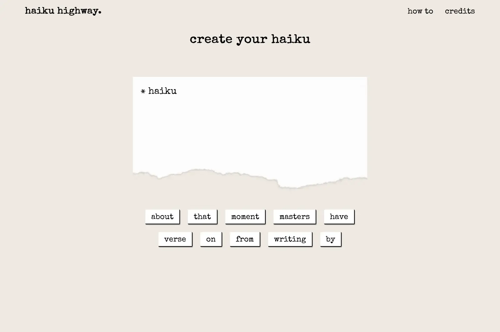

## Table of contents

- [Overview](#overview)
  - [Screenshot](#screenshot)
  - [Links](#links)
- [Built with](#built-with)
- [Authors](#authors)
  - [Alix Faudot](#alix-faudot)
  - [Corey DeCaire](#corey-decaire)
  - [Frances McKenzie](#frances-mckenzie)
  - [Matt Russell](#matt-russell)

## Overview

A group programming project developed by [Alix Faudot](#alix-faudot), [Corey DeCaire](#corey-decaire), [Frances McKenzie](#frances-mckenzie) & [Matt Russell](#matt-russell)

Users input a word to start their haiku, then the Datamuse API returns words that often follow that word; the returned words are used to create a word buttons that the user can select from to continue their haiku. The Datamuse API continues to return new word options until the user has completed their haiku!

### Screenshot

### Links

- [GitHub Repo](https://github.com/haiku-highway/haiku-highway)
- [Live Site](https://haiku-highway.netlify.app/)

## Built with

- React.js
- [Datamuse API](https://www.datamuse.com/api/)
- CSS

## Authors

### Alix Faudot 

- [Portfolio Site](https://www.alixfaudot.com/)
- [LinkedIn](https://www.linkedin.com/in/alixfaudot/)
- [GitHub](https://github.com/alixfcodes)
- [Twitter](https://twitter.com/alixfcodes)

### Corey DeCaire 

- [Portfolio Site](https://www.coreydecaire.com/)
- [LinkedIn](https://www.linkedin.com/in/corey-decaire-621160134/)
- [GitHub](https://github.com/CoreyDeCaire)

### Frances McKenzie

- [Portfolio Site](https://francesm.dev)
- [LinkedIn](https://www.linkedin.com/in/fr-ncesm/)
- [GitHub](https://github.com/frances-m)

### Matt Russell

- [Portfolio Site](https://www.matthewrussell.dev/)
- [LinkedIn](https://www.linkedin.com/in/matthew-russell-dev/)
- [GitHub](https://github.com/MttRussell)

